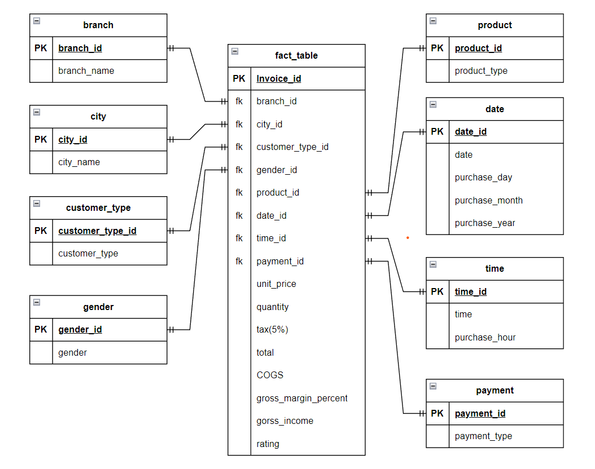

# Supermarket Sales Data Analytics | Modern Data Engineering GCP Project

## Introduction

The goal of this project is to perform data analytics on Supermarket sales data using various tools and technologies, including GCP Storage, Python, Compute Instance, Mage Data Pipeline Tool, BigQuery, and Looker Studio.

## Architecture 

## Technology Used
- Programming Language - Python

Google Cloud Platform
1. Google Storage
2. Compute Instance 
3. BigQuery
4. Looker Studio

Modern Data Pipeine Tool - https://www.mage.ai/

Contibute to this open source project - https://github.com/mage-ai/mage-ai

## Dataset Used
Supermarket Sales Data - This dataset contains sales of the 3 branches of supermarket. It has fields like Invoice id, date, time, customer type, gender, payment type, Unit price, Total, COGS, Tax percent, and few more.

Here is the dataset used in the video - https://github.com/darshilparmar/uber-etl-pipeline-data-engineering-project/blob/main/data/uber_data.csv

More info about dataset can be found here: 
Kaggle Website - https://www.kaggle.com/datasets/aungpyaeap/supermarket-sales

## Data Model

## Looker Studio
Dashboard link - https://lookerstudio.google.com/reporting/31aad5f0-6dd1-4836-aee0-e492e3aff3ea

## YouTube Video
Video Link - https://youtu.be/WpQECq5Hx9g
